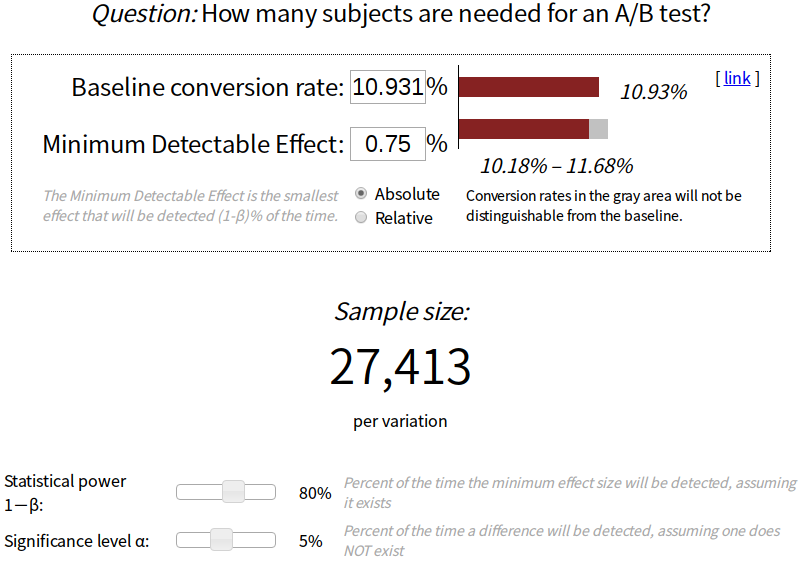

## 优达学城数据分析师纳米学位 P7

### 试验设计

#### 试验概述：免费试学筛选器

在进行此试验时，优达学城当前的主页上有两个选项：“开始免费试学”和“访问课程资料”。如果学生点击“开始免费试学”，系统将要求他们输入信用卡信息，然后他们将进入付费课程版本的免费试学。14 天后，将对他们自动收费，除非他们在此期限结束前取消试用。若学生点击“访问课程材料”，他们将能够观看视频和免费进行小测试，但是他们不会获得导师指导支持或验证证书，无法提交最终项目来获取反馈。

在此试验中，优达学城测试了一项变化，如果学生点击“开始免费试学”，系统会问他们有多少时间投入到这个课程中。如果学生表示每周 5 小时或更多，将按常规程序进行登录。如果他们表示一周不到 5 小时，将出现一条消息说明优达学城的课程通常需要更多的时间投入才能成功完成，并建议学生可免费访问课程资料。在这里，学生可选择继续进行免费试学，或免费访问课程资料。

以下截图展示了试验概况。

我们的假设是这会为学生预先设定明确的期望，从而减少因为没有足够的时间而离开免费试学，并因此受挫的学生数量，同时不会在很大程度上减少继续通过免费试学和最终完成课程的学生数量。如果这个假设最后为真，优达学城将改进整体学生体验和提高导师为能够完成课程的学生提供支持的能力。

实验的分组单元为 cookie，尽管学生参加的是免费试学，但在登录后他们的用户id 便被跟踪。同一个用户 id 不能两次参加免费试学。对于不参加免费试学的用户，他们的用户id 不会在试验中被跟踪，即使他们在访问课程概述页面时登录了网站。

### 度量选择

#### 不变度量选择：

-    Cookie的数量：即查看课程概述页面的唯一 cookie 数量。

     （实验的分组单元为cookie，cookie可以很好地随机分配到实验组和对照组，且用户浏览主页发生在选择任一按钮及被提问之前，指标数量不受实验影响，是很好的总体规模指标）

-    点击次数：即点击“开始免费试用”按钮（在免费试用屏幕触犯前发生）的唯一 cookie 的数量。

     （用户需要先点击“免费试用”按钮才能进入到实验发生的页面，点击按钮的次数不受实验结果的影响，是一个实际不变量指标。）

-    点进概率：即点击“开始免费试用”按钮的唯一 cookie 除以查看课程概述页面的唯一 cookie 的数量所得的结果。

     （相当于点进“免费试用”页面的cookie与实验总体采集cookie数量的比值。不受实验设计的影响，同样是一个实际不变量指标）

#### 评估度量选择：

-    总转化率：即完成登录并报名参加免费试用的用户 id 的数量除以点击“开始免费试用”按钮的唯一 cookie 的数量所得的结果。

     （由于询问了是否一周内可以投入足够的时间，实验组可能会有更多用户由于投入时间不足而倾向于免费访问课程资料学习而非登录报名参与试学，因此实验组的可能会较低）

-    留存率：即在14 天期限后仍保持参加（并进行了至少一次支付）的用户 id 的数量除以完成登录的用户 id 的数量。

     （由于实验组完成登录的用户大多数为认为自己可以投入足够时间学习，在14天内保持参加学习/未退出的用户比例可能会高于对照组）

-    净转化率：即在14 天期限结束后仍然参加（并至少进行了一次支付）的用户 id 的数量除以点击“开始免费试用”按钮的唯一 cookie 的数量所得的结果。

     （由于实验设置，实验组报名参加试学的用户数量可能降低，但留存率可能上升，而净转化率由两者共同决定。因此净转化率在两组间很可能存在差异，但无法具体判断呈现怎样的变化）

#### 期望的实验结果：

##### 从评估指标角度：

-         总转化率显著降低
-         留存率显著上升
-         净转化率能有所提升

##### 从实验的实际效果角度：

- 能够减少因无法投入足够学习时间而在中途退出付费教学的学生数量
- 在减少因个人时间因素退出教学而受挫的学生数量的同时不会减少太多继续付费学习并通过课程的学生数量。

#### 测量标准偏差

##### 基准值表：

| Unique  cookies to view page per day:    | 40000     |
| ---------------------------------------- | --------- |
| Unique cookies to click  "Start free trial" per day: | 3200      |
| Enrollments per day:                     | 660       |
| Click-through-probability on  "Start free trial": | 0.08      |
| Probability of enrolling,  given click:  | 0.20625   |
| Probability of payment, given  enroll:   | 0.53      |
| Probability of payment, given  click     | 0.1093125 |

在有 5000 个 cookie 样本大小访问课程概述页面的情况下：

-  Cookie 的数量=5000
-  “开始免费试用”的点击次数=5000*0.08=400
-  完成登录的用户 id数=400*0.20625=82.5

##### 计算标准偏差：

对于服从二项分布的指标，标准偏差的计算可使用

$$SD=\sqrt{\frac{p(1-p)}{N}}$$

其中，p为实验成功的概率，N为实验的样本容量

因此，对于每个评估指标：

$$SD_{总转化率}=\sqrt{\frac{p(1-p)}{N}}=\sqrt{\frac{0.20625*(1-0.20625)}{400}}=0.0202$$

$$SD_{留存率}=\sqrt{\frac{p(1-p)}{N}}=\sqrt{\frac{0.53*(1-0.53)}{82.5}}=0.0549$$

$$SD_{净转化率}=\sqrt{\frac{p(1-p)}{N}}=\sqrt{\frac{0.1093125*(1-0.1093125)}{400}}=0.0156$$

##### 分析估计与经验变异是否类似：

对于总转化率和净转化率，实验的分组单元与分析单元均为点击“免费试学”按钮的cookie，根据经验得出的差异性会比较接近分析估计。

对于留存率，分组单元为cookie，而分析单元为用户id（大于分组单元），可能会导致经验变异性高于分析方法计算得出的差异性，在时间允许的情况下有必要进行经验估计。

#### 规模：

##### 样本数量和支持

在分析阶段，未使用Bonferroni 校正。

当使用 alpha = 0.05, beta = 0.2，为了确保每个度量具有足够的数据支持，我们可以使用这个[在线计算器](http://www.evanmiller.org/ab-testing/sample-size.html) 针对每个评估指标计算试验所需的网页访问量。（利用基准表提供的信息以及“度量选择”部分提供的指标的最小实际显著性）

- 对于总转化率，需要的网页访问量如下：

- 对于留存率，需要的网页访问量如下：

- 对于净转化率，需要的网页访问量如下：

计算总的页面访问量：（两个组的总体访问量）

- 对于总转化率：25835*2/0.08=645875
- 对于留存率：39115*2/0.20625/0.08=4741212
- 对于净转化率：27413*2/0.08=685325

为了保证提供足够量的数据支持，我们选择最大的页面访问量作为开展试验所需的支持网页访问数，即：4741212

##### 选择持续时间和风险暴露

首先，从尽可能满足试验所有评估指标的角度出发，设置需要转移的流量总量为上一小节中最大的网页访问数4741212，即使转移udacity每日运行的全部流量到实验中，采集足够量的数据，仍需要：

$$4741212/40000=119(天)$$

也就是说实验需要持续4个月之久。这对于实验设计来说，是非常不现实的持续时长，首先对于一项实验无法投入过高的时间成本，其次流量、评估指标可能在较长时间内产生意料之外的变化而影响实验效果。因此，我们可以取消对“留存率”这一评估指标的测试，仅考虑总转化率及净转化率的测试。

当前条件下，需要选取的流量总量为685325：

- 当转移100%的流量，需要：

$$685325/40000=17.133125\approx18(天)$$

当前实验没有采集用户的个人敏感信息，因此，转移多数流量不会增大暴露用户信息的风险。但是，由于在过短时间内采集的数据不足以反映指标变动的趋势，以及为了方便在进行这一实验时能够提供流量给同时开展的其他实验，可以考虑转移50%的流量到实验中。

- 当转移50%的流量，需要：

$$685325/40000/0.5=34.26625\approx35(天)$$

最终选择：

**舍弃“留存率”这一指标，将50%的流量装入实验，利用35天时间来运行实验。**

### 实验分析

#### 合理性检查

当前，需要针对每个不变度量，对期望观察到的值、实际观察的值及度量是否通过合理性检查给出 95% 置信区间:

先计算两组中观测指标的总量：

对于实验组：

Pageviews=344660 	Clicks=28325

对于对照组：

Pageviews=345543 	Clicks=28378

- 对于Cookie的数量:

  $$SE=\sqrt{\frac{0.5*0.5}{344660+345543}}=0.000601841$$

  $$m=SE*1.96=0.001179608$$

  $$则置信区间为(0.4988,0.5012)$$

  $$\hat p=\frac{345543}{344660+345543}=0.5006 \in (0.4988,0.5012)$$

  可以通过合理性检验。

- 对于点击次数：

  $$SE=\sqrt{\frac{0.5*0.5}{28325+28378}}=0.002099747$$

  $$m=SE*1.96=0.004115504$$

  $$则置信区间为(0.4959,0.5041)$$

  $$\hat p=\frac{28378}{28378+28325}=0.5005 \in (0.4959,0.5041)$$

  可以通过合理性检验。

- 对于点进概率：

  $$合并点击概率P_{pool}=\frac{Xcont+Xexp}{Ncont+Nexp}=\frac{28325+28378}{344660+345543}=0.082154091$$

  $$SE=\sqrt{P_{pool}*(1-P_{pool})*(\frac 1{Ncont}+\frac 1{Nexp})}=0.000661061$$

  $$m=SE*1.96=0.001295679$$

  $$则置信区间为(-0.0013,0.0013)$$

  $$\hat d=P \hat exp−P \hat cont=0.000056627 \in (-0.0013,0.0013)$$

  可以通过合理性检验。

  #### 结果分析

##### 检查实践和统计显著性

 由于支付行为发生在注册并开始免费试听课程后的十四天，所以电子表格中“Payments”这一字段采集的时间在“Date”字段所示时间的14天之后。尽管实验采集了37天的数据，但鉴于后14天注册课程的用户尚未产生支付行为，所以我们仅针对两组数据的前23天的Clicks、Enrollments、Payments数量进行统计分析。

 对于对照组：

Clicks= 17293	Enrollments=3785	Payments=2033

对于实验组：

Clicks= 17260	Enrollments=3423	Payments=1945

接下来对于每个评估指标进行统计和实际显著性的检验：

（因为选择实验持续时间阶段，由于评估“留存率”这一指标所需的实验流量过大，我们仅采集了可以满足其他两个评估指标的数据量，这一阶段的显著性分析也仅针对另两个指标开展）

- 对于总转化率：

  $$合并转化概率P_{pool}=\frac{Econt+Eexp}{Ccont+Cexp}=\frac{3875+3423}{17293+17260}=0.208607067$$

  $$SE=\sqrt{P_{pool}*(1-P_{pool})*(\frac 1{Ccont}+\frac 1{Cexp})}=0.004371675$$

  $$m=SE*1.96=0.008568484$$

  $$\hat d=P \hat exp−P \hat cont=−0.020554875 $$

  即95%置信度双尾检验的置信区间为(-0.029123359,-0.011986391)

  因为$$0 \notin(-0.029123359,-0.011986391)$$

  所以实验变更对总转化率的影响在95%置信度上具有统计显著性

  又因为$$-d_{min}=-0.01 \notin(-0.029123359,-0.011986391)$$

  实验变更对总转化率的影响同样具有实际显著性

- 对于净转化率：

  $$合并转化概率P_{pool}=\frac{Pcont+Pexp}{Ccont+Cexp}=\frac{2033+1945}{17293+17260}=0.115127485$$

  $$SE=\sqrt{P_{pool}*(1-P_{pool})*(\frac 1{Ccont}+\frac 1{Cexp})}=0.003434134$$

  $$m=SE*1.96=0.006730902$$

  $$\hat d=P \hat exp−P \hat cont=−0.004873723 $$

  即95%置信度双尾检验的置信区间为(-0.011604625,0.001857179)

  因为$$0 \in(-0.011604625,0.001857179)$$

  所以实验变更对净转化率的影响不具有统计显著性

  又因为$$-d_{min}=-0.0075 \in(-0.011604625,0.001857179)$$

  实验变更对总转化率的影响同样不具有实际显著性

   

  总结：

  在当前环节下未使用Bonferroni 校正。

- 对于总转化率：

  差异的置信区间：(-0.0291,-0.0120)

  统计显著性 `✓`	实际显著性`✓`

- 对于净转化率：

  差异的置信区间：(-0.0116,0.0019)

  统计显著性 `✘`	实际显著性`✘`

##### 符号检验

首先，我们将符号检验的“success”定义为：对照组的转化率高于实验组

可以使用[在线计算器](http://graphpad.com/quickcalcs/binomial1.cfm)进行符号检验计算。

- 对于总转化率：

  Number of "successes": 19 

  Total Number：23

  符号检验结果：

  

  得到双尾检验的P值为$$0.0026<\alpha=0.05$$

  表明当前结果的出现在95%置信度上不具有随机性

  即：可以通过符号检验

- 对于净转化率：

  Number of "successes": 13

  Total Number：23

  符号检验结果：

  

  得到双尾检验的P值为$$0.6776>\alpha=0.05$$

  表明当前结果的出现具有随机性

  即：无法通过符号检验

总结：

在当前环节下未使用Bonferroni 校正。

- 对于总转化率：

  P-Value=0.0026	具有统计显著性

- 对于净转化率：

  P-Value=0.6776   不具有统计显著性

##### 汇总

我在实验中未使用Bonferroni校正。考虑因素如下：

- 当前我们假设所有指标全部具有统计显著性意义，以确保所测试变更的准确效果从而做出是否发布这一变更的决策，在当前情况下使用Bonferroni校正可能无法得到预期的结果。
- 在当前实验中，我们需要观测的两个指标有很大的相关性。在这种情况下，如果使用Bonferroni校正，可能会发生实验的更改对某些指标确实存在具有统计显著性的影响但由于进行了过于保守的校正，是变更不易被观测

对于当前检验的两个评估指标，效应量检验和符号检验得到的结果差异不大。均反映了，这项变更在统计意义上对于总转化率的降低有显著意义，但对于净转化率的影响不具有显著性。而实际显著性的检测也得到相同的结论。

#### 建议

我的建议是不启动这项更改。

因为从当前得到的结果出发。总转化率的降低具有实际显著性，说明这项更改可以显著减少因未考虑自己的时间投入而盲目参与付费教学的学员数量，但这并没有达到我们”减少受挫的学生数量，同时不会在很大程度上减少继续通过免费试学和最终完成课程的学生数量“的预期。因为净转化率的变化没有显著意义，进入付费教学阶段的学生数量有可能大幅减少从而也影响udacity在付费课程上的收益。同时，我们还没有收集到足够的数据对留存率的差异得出结论，无法判断，这一更改是否能显著增加注册后持续学习并付费的学员比例，以及显著减少受挫离开付费教学的学员数量。

我认为为了得出确切的建议，还应当进行后续实验，测定当前的变更是否会显著影响其他我们感兴趣但尚未得出结论的指标。

如测试”留存率“在两组间的差异，需要延长实验的持续时间（如继续持续采集接下来两个月的流量），并同时观测学员的付费情况，直到采集到足够数量的实验数据来判断留存率的提升（降低）是否具有显著意义或监测到这一实验变更使udacity的在付费课程上的收入产生了很大程度上的下滑。

#### 后续实验

##### 实验设计

我认为学生是否留存的决定因素不仅在于能否为学习投入足够的时间，同样在于对课程内容的兴趣程度以及理解能力。因此，对于提高学员留存率，我认为可以发起一项新的变更并投入实验：

在学员注册课程并进入到14天的免费试学中时，我们可以根据学员的进度，在学员完成一小阶段的课程过后，通过弹窗向学生发出即时消息/调查。询问学员以下问题：

- 是否大致了解当前所修纳米学位的课程体系？该学位的课程内容是否对个人职业发展/兴趣延伸/辅助学习有意义？
- 自己目前掌握的知识是否达到该课程的先修条件？学习初期的课程是否很吃力？
- 通过一段时间的试听，自己对当前所课程是否还有浓厚的兴趣？
- 注册进入试听后的时间投入，是否能达到之前的预期？

根据学员的回答，鼓励学员继续投入相应的时间完成学习或建议学员先完成学位的先修课程，打好基础或推荐学员选择更适合自己的其他方向/难度的课程。

##### 实验假设

我的假设是：该项变更可以使学员对课程以及自我评估的定位更加准确。通过这项实验，由于更能推动学员思考目前的课程是否适合自己/是否有足够动力在规定时间内完成所有课程和项目顺利毕业，可能会减少付费进行学习的学生数量，但同时也会减少付费后发现课程内容与自己的预期不符/没有足够时间和能力完成课程而中途退出的学员数量。如果假设为真，udacity会将此项变更面向更多比例/所有注册用户推广。

##### 评估度量

- 留存率：即免费试学14 天后仍保持参加（并进行了至少一次支付）的用户 iID的数量除以完成登录的用户 ID 数量。
- 课程完成率：即课程时限内完成所有课程及项目的用户ID数量除以完成支付活动参与到付费教学阶段的用户ID数量。
- 转化率：即课程时限内完成所有课程及项目的用户ID数量除以完成登录的用户 ID 数量。

##### 转移单位

用户ID

用户一旦注册某课程，他的用户ID将被跟踪。该用户每完成一阶段的课程，系统即向他推送问询弹窗。

由于我们关心的是注册用户完成课程的情况，将用户划分到实验组或对照组可以根据用户ID进行，跟踪和推送活动也需根据用户ID进行，同时，我们需要确保当用户更换设备/cookie时，所在分组不会产生差异，因此，选用用户ID作为转移单位是较好的选择。

### 参考资料

- [Project 7 - A/B Testing by:Michael Phillips](https://mphillips55.github.io/A_B_Testing/A_B+Testing+Project+-+Michael+Phillips.html)
- [浏览量在线计算器](http://www.evanmiller.org/ab-testing/sample-size.html)
- [符号检验在线计算器](http://graphpad.com/quickcalcs/binomial1.cfm)